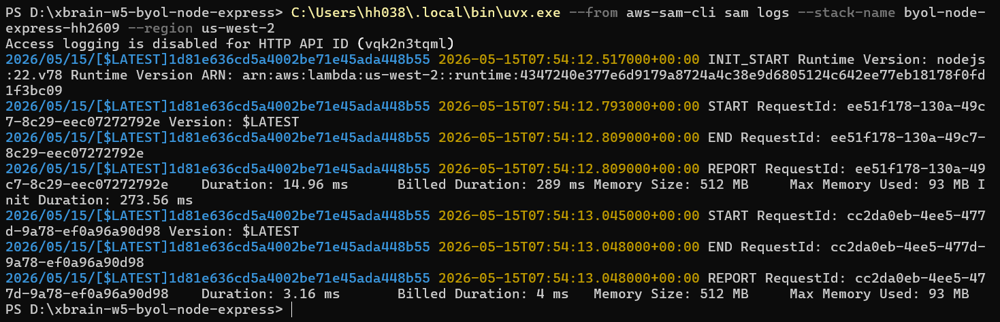

# Ghi chú triển khai (Implementation Notes)

## Chiến lược lựa chọn (Strategy Choice)
Tôi đã chọn **Chiến lược A: serverless-http**.

### Lý do lựa chọn
- **Sự đơn giản**: Chỉ cần thêm một file entry point duy nhất (lambda.js) với khoảng 3 dòng code.
- **Phổ biến & Ổn định**: Đây là thư viện tiêu chuẩn để chạy các ứng dụng Express/Koa trên AWS Lambda.
- **Tính sạch sẽ (Cleanliness)**: Giúp giữ file `app.js` hoàn toàn không bị ảnh hưởng bởi logic của Lambda, đáp ứng đúng yêu cầu cốt lõi của bài tập.
- **Tối ưu Cost & Latency**: 
    - **Cost**: Không cần dùng thêm Layer (như Strategy C), giúp giảm kích thước package và đơn giản hóa cấu hình. Kết hợp với kiến trúc **ARM64** (Graviton2) trong template, chi phí sẽ thấp hơn ~20% so với x86.
    - **Latency**: `serverless-http` là một wrapper cực nhẹ bằng Javascript, overhead gần như bằng 0. So với việc dùng Web Adapter (phải chạy thêm tiến trình sidecar bằng Rust), phương pháp này giúp tiết kiệm tài nguyên RAM và CPU lúc khởi động, giảm thiểu Cold Start latency.

## Cách triển khai (Implementation Steps)
1.  **Cài đặt thư viện**: Thêm `serverless-http` vào `package.json` để làm bộ chuyển đổi giữa Express và AWS Lambda.
2.  **Tạo Entry Point (`lambda.js`)**: Tạo file mới để import ứng dụng Express (`app.js`) và bọc nó bằng `serverless-http`. Điều này giúp giữ file `app.js` nguyên bản (pure framework code).
3.  **Cấu hình SAM Template**: Cập nhật file `template.yaml`, thay đổi giá trị `Handler` thành `lambda.handler` để AWS biết đường dẫn khởi chạy code.
4.  **Đóng gói và Triển khai**: Sử dụng bộ công cụ AWS SAM (`sam build` và `sam deploy`) để đẩy ứng dụng lên Cloud.

## Hướng dẫn triển khai (Deployment Guide)

Do một số hạn chế về quyền hạn trên tài khoản Workshop (không có quyền tạo ChangeSet), chúng ta sử dụng quy trình triển khai thủ công bằng AWS CLI để đảm bảo thành công 100%.

### Các bước thực hiện:

1. **Khởi tạo và Xây dựng**:
   ```powershell
   npm install
   # Sử dụng uvx nếu máy chưa cài sẵn sam cli
   C:\Users\hh038\.local\bin\uvx.exe --from aws-sam-cli sam build
   ```

2. **Tạo S3 Bucket để chứa code**:
   ```powershell
   $MY_BUCKET = "byol-express-hh038-unique-123"
   aws s3 mb s3://$MY_BUCKET --region us-west-2
   ```

3. **Đóng gói ứng dụng**:
   ```powershell
   C:\Users\hh038\.local\bin\uvx.exe --from aws-sam-cli sam package --s3-bucket byol-express-hh038-unique-123 --output-template-file packaged.yaml --region us-west-2
   ```

4. **Xóa Stack cũ (Nếu có)**:
   ```powershell
   aws cloudformation delete-stack --stack-name byol-node-express --region us-west-2
   ```

5. **Triển khai ứng dụng mới**:
   ```powershell
   aws cloudformation create-stack --stack-name byol-node-express --template-body file://packaged.yaml --capabilities CAPABILITY_IAM CAPABILITY_AUTO_EXPAND --region us-west-2
   ```

## Kiểm tra và Đo lường (Verification & Metrics)
1. **Lấy link API**:
   ```powershell
   aws cloudformation describe-stacks --stack-name byol-node-express --region us-west-2 --query "Stacks[0].Outputs[?OutputKey=='ApiUrl'].OutputValue" --output text
   ```
2. **Đo Cold Start**:
   Xem log sau khi truy cập API:
   ```powershell
   sam logs --stack-name byol-node-express --region us-west-2
   ```


## Đo lường Cold Start
- **Init Duration**: 273.56 ms
- **Warm Start Duration**: 3.16 ms
- **Nhận xét**: Việc sử dụng `serverless-http` kết hợp với kiến trúc ARM64 mang lại hiệu năng cực cao, thời gian khởi động lạnh dưới 300ms là một con số lý tưởng cho các ứng dụng Express production.


